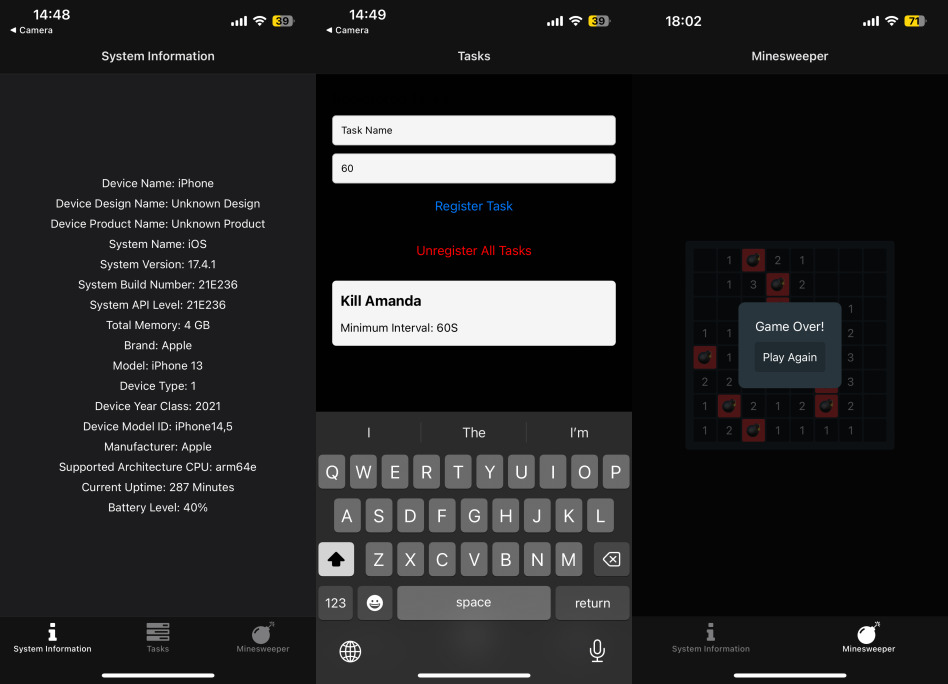
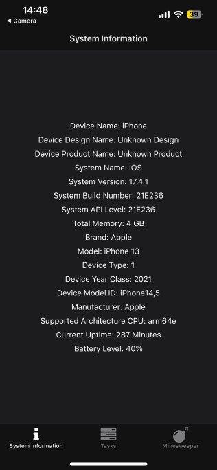
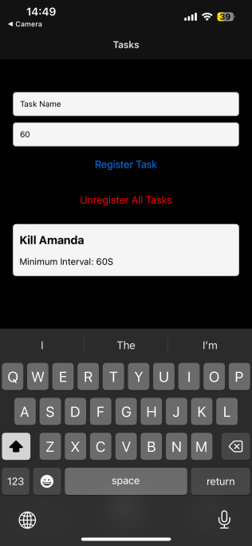
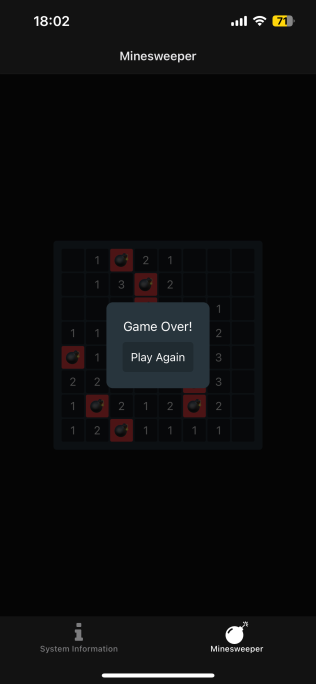

# System Info, Task Manager, & Minesweeper App



A React Native application built with Expo that provides three key features:

1. **System Information**: Displays general system details about the device, such as the operating system, device name, manufacturer, and model.
2. **Task Manager**: Allows users to create and manage tasks with a default interval of 60 seconds.
3. **Minesweeper**: A simple version of the classic Minesweeper game, with an 8x8 board and 10 mines.

---

## Table of Contents

- [Features](#features)
- [Screenshots](#screenshots)
- [Installation](#installation)
- [Usage](#usage)
- [Technologies Used](#technologies-used)
- [License](#license)

---

## Features

### System Information

- Displays:
  - Device name
  - Operating system name and version
  - Device brand and model
  - Manufacturer
- Adapts to light and dark mode using the system's color scheme.

### Task Manager

- Displays manually created tasks within the application with an interval, defaulting to 60 seconds.

### Minesweeper

- A minimal, classic Minesweeper implementation.
- **8x8 grid** with **10 mines**.
- Allows flagging cells and reveals adjacent safe cells automatically.

---

## Screenshots

### System Info Screen

  

### Task Manager Screen



### Minesweeper Screen

  

---

## Installation

### Prerequisites

- Install [Node.js](https://nodejs.org/) (>= 14.x).
- Install [Expo CLI](https://expo.dev/) globally:

```bash
npm install -g expo-cli
```

## Steps

### Clone the repository

```bash
git clone https://github.com/Kwaddo/system-info
cd system-info
```

### Install dependencies

```bash
npm install
```

### Run the application

```bash
expo start
```

### Follow the Expo instructions to run the app on

- iOS: Open the Expo Go app and scan the QR code.
- Android: Open the Expo Go app and scan the QR code or use an emulator.

## Usage

### System Information Usage

- Navigate to the "System Info" tab to view details about your device.

### Task Manager Usage

- Navigate to the "Task Manager" tab to manage tasks.

### Minesweeper Usage

- Navigate to the "Minesweeper" tab to play the game.
- Left-click or tap a cell to reveal it.
- Long-press or right-click to flag a cell.

### Technologies Used

- React Native: Framework for building native apps.
- Expo: Platform for building and running React Native apps.
- expo-device: For fetching system details.
- TypeScript: For type safety and cleaner code.
- FontAwesome: For icons used throughout the app.

## Contributing

### Contributions are welcome! To contribute~

1) Fork the repository.
2) Create a new branch for your feature/bugfix.
3) Commit and push your changes.
4) Submit a pull request.

## License

This project is licensed under the MIT License. See the LICENSE file for more details.
